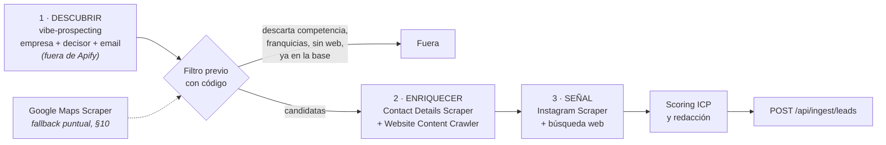

# APIFY — Playbook de enriquecimiento de leads

> Versión 1.1 · 22 agosto 2026 · Complementa `ARQUITECTURA.md` §7 y `VIBE_PROSPECTING.md`
> Todos los precios de este documento están verificados en las páginas oficiales de cada actor el 21/08/2026. Cambian: compruébalos antes de escalar volumen.

---

## 1. Qué papel juega Apify

Apify es el **motor de enriquecimiento** del sistema. Es la parte que convierte una lista de 80 nombres de empresa en 80 fichas con contenido, contacto y señal.

**Ya no descubre empresas.** Desde el 22/08/2026 el descubrimiento lo hace `vibe-prospecting`, que además devuelve al decisor con email — algo que Google Maps no daba nunca. Ver `VIBE_PROSPECTING.md`.

Dos papeles, y sólo uno sigue vivo:

- **Enriquecer (imprescindible).** Dada la web de una empresa, sacar contenido, contacto y señal. Es el valor que aporta Apify y no depende de dónde salga la lista.
- **Descubrir (retirado del ciclo semanal).** Google Maps queda como recurso puntual para barrer una ciudad concreta cuando haga falta cobertura exhaustiva. Ver §10.

Lo que Apify **no** es: no cualifica, no decide y no escribe. Eso lo hace el motor en Claude leyendo lo que Apify devuelve. Apify trae materia prima; el criterio lo pone el modelo con las reglas del ICP.

**Dónde se ejecuta:** desde el motor (Claude), nunca desde la app. Se mantiene la regla de arquitectura: la app muestra y aprueba, no busca. El token de Apify vive en el entorno del motor y en las variables de Vercel sólo si algún día un webhook necesita responder a la app.

---

## 2. Dónde encaja Apify en el pipeline



**Apify entra en el paso 2, no en el 1.** La lista de empresas y el decisor con email vienen de `vibe-prospecting`. Apify hace lo que esa fuente no hace: leer la web de la empresa para entender qué proyectos hace y encontrar la señal que justifica escribir ahora.

**El filtro previo es lo que hace que esto sea barato.** Enriquecer 200 empresas cuesta cuatro veces más que enriquecer las 50 que han pasado el corte. Descartar antes de enriquecer no es una optimización: es la diferencia entre caber en el presupuesto y no caber.

**Los actores de enriquecimiento sólo necesitan una URL.** Da igual de dónde venga la lista: si mañana cambia la fuente de descubrimiento, esta parte no se toca.

---

## 3. Los actores

| Paso | Actor | ID | Qué aporta | Precio verificado (21/08/2026) |
|---|---|---|---|---|
| — | **Google Maps Scraper** *(fallback, fuera del ciclo semanal — §10)* | `compass/crawler-google-places` | Nombre, categoría, web, teléfono, dirección, valoración. Nunca el decisor | Desde **1,50 $ / 1.000 lugares** |
| 2 | **Contact Details Scraper** | `vdrmota/contact-info-scraper` | Emails, teléfonos y perfiles sociales a partir de la web de la empresa | Desde **1,05 $ / 1.000 páginas** |
| 2 | **Website Content Crawler** | `apify/website-content-crawler` | El texto de la web en markdown: proyectos, clientes, "sobre nosotros", premios | ≈ **0,20 $ / 1.000 páginas** con rastreador HTTP simple; **0,50-5 $** con navegador |
| 3 | **Instagram Scraper** | `apify/instagram-scraper` | Obra reciente publicada, aperturas, premios, colaboraciones | Desde **2,70 $ / 1.000 resultados** en plan gratuito; 2,30 $ en Starter |

> **Validado el 23/08/2026** contra el `inputSchema` real de cada actor (vía `GET /v2/acts/{actorId}/builds/{buildId}` con el token de Apify — sin necesidad de entrar en la consola). Se encontró y corrigió un error: Website Content Crawler no usa `maxRequestsPerStartUrl`/`maxDepth` (eso es de Contact Details Scraper), usa `maxCrawlPages`/`maxCrawlDepth`. Ver el detalle en §4. Si el actor cambia de versión, repite esta comprobación antes de confiar en los ejemplos de abajo.

---

## 4. Qué enriquece Apify en cada segmento

El descubrimiento ya no vive aquí: las recetas de búsqueda por segmento, con los universos medidos, están en `VIBE_PROSPECTING.md` §4. Lo que sigue es lo que Apify hace **después**, cuando ya hay una empresa y una web.

| Segmento | Esfuerzo | De dónde sale la lista | Qué le pide Apify |
|---|---|---|---|
| Arquitectura e interiorismo | 30 % | `vibe-prospecting` (75 decisores con email en Levante, 961 en España) | Proyectos publicados, si hay obra hotelera, premios, email del estudio |
| Agencias de comunicación y eventos | 25 % | `vibe-prospecting` (4.619 decisores con email en España) | Clientes, campañas, premios que organizan |
| Grupos tipo Vocento | 25 % | Lista nominal + búsqueda web | Calendario de premios y eventos |
| Hoteles premium | 10 % | `vibe-prospecting` (96 decisores con email en Levante) | Reformas, nuevo chef, entrada en guías |
| Restauración | 5 % | `vibe-prospecting`, mismo universo | Carta, identidad del proyecto, aperturas |
| Joyería / retail de autor | 5 % | Búsqueda web | Colecciones, colaboraciones |

**La señal es lo que Apify aporta de verdad.** `vibe-prospecting` te dice quién dirige el estudio y cómo escribirle; no te dice que la semana pasada publicaron el proyecto de un hotel en Dénia. Eso sale de leer su web y su Instagram.

### Paso 2 aplicado — enriquecer las candidatas

**Contact Details Scraper** (`vdrmota/contact-info-scraper`) — validado el 23/08/2026 contra el esquema real del build (`maxRequestsPerStartUrl` y `maxDepth` son correctos aquí):

```json
{
  "startUrls": [{ "url": "https://estudio-ejemplo.com" }],
  "maxRequestsPerStartUrl": 12,
  "maxDepth": 2,
  "mergeContacts": true
}
```

`mergeContacts` (no estaba documentado antes) combina todos los contactos de un mismo dominio en una sola fila — actívalo, evita duplicados por subpágina.

**Website Content Crawler** (`apify/website-content-crawler`) — **corregido el 23/08/2026**: el borrador anterior usaba `maxRequestsPerStartUrl`/`maxDepth`, que **no existen en este actor** (esos nombres son de Contact Details Scraper). Los campos reales, validados contra el esquema del build `version-0` (build 0.3.94):

```json
{
  "startUrls": [{ "url": "https://estudio-ejemplo.com" }],
  "crawlerType": "cheerio",
  "maxCrawlDepth": 2,
  "maxCrawlPages": 12,
  "respectRobotsTxtFile": true
}
```

`crawlerType` acepta `"cheerio"` (HTTP simple, el barato), `"jsdom"`, o variantes de Playwright (browser real, más caro). `respectRobotsTxtFile` existe como parámetro nativo del actor — actívalo siempre, es la forma más directa de cumplir la regla 1 de la sección 7 de este documento.

Doce páginas por web es suficiente para llegar a "contacto", "estudio" y "proyectos" sin dispararse. Si una web no da email nominal en doce páginas, no lo va a dar en cincuenta.

### Paso 3 aplicado — señal en Instagram

Validado el 23/08/2026 contra el esquema real: `resultsType`, `directUrls`, `resultsLimit` y `onlyPostsNewerThan` son correctos tal cual.

```json
{
  "directUrls": ["https://www.instagram.com/estudio_ejemplo/"],
  "resultsType": "posts",
  "resultsLimit": 12,
  "onlyPostsNewerThan": "6 months"
}
```

Sólo para las que ya han pasado el corte y les falta gancho. Doce publicaciones bastan para saber qué han hecho últimamente.

---

## 5. Control de coste

Regla de oro: **ningún actor se lanza sin límite de resultados.** Un `maxCrawledPlacesPerSearch` olvidado se come el crédito del mes en una tarde.

Coste en Apify de una tanda de **20 leads cualificados**, ya sin Maps:

| Paso | Volumen | Coste |
|---|---|---|
| Descubrimiento (`vibe-prospecting`) | ~55 empresas con decisor | 0 $ en Apify — se paga en créditos aparte, ver `VIBE_PROSPECTING.md` §6 |
| Filtro con código → quedan ~50 candidatas | — | 0 $ |
| Contact Details: 50 webs × 3 páginas | 150 páginas | ≈ 0,16 $ |
| Website Content Crawler: 50 webs × 8 páginas (HTTP simple) | 400 páginas | ≈ 0,08 $ |
| Instagram: 20 perfiles × 12 posts | 240 resultados | ≈ 0,65 $ |
| **Total por tanda en Apify** | | **≈ 0,89 $** |

Con cuatro tandas al mes: **≈ 3,60 $/mes**, dentro del crédito gratuito de 5 $/mes de Apify. A esto hay que sumar los créditos de `vibe-prospecting`, que todavía no están medidos (P-12).

**Dónde está el gasto, en orden:** Instagram (73 %), extracción de contacto (18 %), lectura de webs (9 %). Si hay que recortar, se recorta Instagram: actívalo sólo para leads de nivel A que no tengan señal por otra vía.

[Confianza media en estas cifras] Son estimaciones a partir de los precios publicados. El coste real depende del peso de cada web y de cuántas páginas rastree de verdad cada actor. Mide la primera tanda y corrige: `ejecuciones.coste_estimado` está en el esquema justo para eso.

---

## 6. Integración técnica

**Ejecución síncrona** (tandas pequeñas, respuesta inmediata):

```
POST https://api.apify.com/v2/acts/compass~crawler-google-places/run-sync-get-dataset-items
Authorization: Bearer $APIFY_TOKEN
Content-Type: application/json
```

**Ejecución asíncrona con webhook** (tandas grandes que tardan minutos): lanzar con `POST /v2/acts/{actorId}/runs` y configurar un webhook de Apify que avise al terminar. El motor recoge el dataset y sigue.

Notas:
- En la URL, el `/` del ID del actor se escribe `~`: `compass~crawler-google-places`.
- Apify ofrece también un servidor MCP que permitiría llamar a los actores como herramientas desde Claude. **No he verificado su estado ni su compatibilidad actual**; si funciona, simplifica el motor. Está anotado como pendiente en `ESTADO.md`.
- El token nunca va al navegador ni a una variable `NEXT_PUBLIC_`.

---

## 7. Límites que respetamos

1. **Antes de rastrear un sitio, se mira su `robots.txt`** y sus condiciones. Si prohíbe la extracción automatizada, no se rastrea.
2. **Sólo datos publicados abiertamente**: lo que cualquiera ve entrando en la web o en el perfil. Nada tras un login.
3. **Ritmo razonable.** No se martillea un dominio pequeño con cientos de peticiones.
4. **Origen guardado siempre.** Cada dato que entra por Apify lleva `fuente` = el actor y `fuente_url` = la página concreta. Sin eso, no entra.
5. **Los datos personales que aparezcan** (el email de una persona en la web de su estudio) siguen las reglas de la sección 8 de `ARQUITECTURA.md`: son datos profesionales, con origen trazable, con derecho de baja y con supresión permanente.

---

## 8. LinkedIn — por qué no está en el pipeline

Pediste incluirlo y entiendo perfectamente por qué: es donde está el decisor con nombre y cargo, y eso es justo lo que más valor tiene. Pero no voy a diseñar una extracción automatizada de LinkedIn, y prefiero decírtelo claro antes de que lo montes:

- **Sus condiciones de uso prohíben el scraping.** Existen actores en Apify que lo hacen; que existan no cambia lo que dice el contrato que aceptó quien tiene la cuenta.
- **El riesgo recae sobre una cuenta real.** Los bloqueos van contra el perfil que se usa, y aquí el perfil sería el de Baladre o el tuyo.
- **El riesgo legal no es teórico.** LinkedIn ha demandado a empresas de scraping. Añade que estos datos son personales y estamos en la UE.
- **Contamina justo lo que queremos proteger.** El sistema entero se apoya en poder decir "este dato viene de aquí, mira el enlace". Un dato sacado saltándose los términos de una plataforma rompe esa cadena.

**Lo que sí resuelve el mismo problema:**

| Alternativa | Qué da | Coste |
|---|---|---|
| **LinkedIn Sales Navigator** | La vía legítima y de pago para identificar decisores. Búsqueda por cargo, sector y tamaño | Suscripción propia. No he verificado el precio actual |
| **La skill `vibe-prospecting`** | Ya la tienes: personas, cargos y contacto de fuentes agregadas | Incluida |
| **La propia web de la empresa** | En estudios y agencias pequeñas, el "sobre nosotros" trae nombre, cargo y a menudo email del socio fundador. Es el caso mayoritario en el ICP de Baladre | Ya está en el paso 2 |
| **Consulta manual** | Una persona abre el perfil, ve quién dirige y lo anota. Legítimo y suficiente para 20 leads de calidad al mes | Tiempo |

Para el ICP de Baladre —estudios de dos a diez personas, agencias medianas, hoteles independientes— **la web propia y la skill cubren la mayoría de los casos**. LinkedIn aportaría sobre todo en los grupos grandes tipo Vocento, que son quince empresas y se trabajan a mano de todos modos.

Si aun así quieres incluirlo, es tu decisión y la de Baladre, no mía: está anotado como **P-08** en `ESTADO.md` para que lo consultes con quien revise la parte legal. Lo que no voy a hacer es dejarlo escrito en la arquitectura como si fuera una pieza más, sin advertencia.

---

## 9. Economía de contexto — dónde se van los tokens

Apify se cobra por resultado, pero **el gasto grande no es Apify: es meter lo que devuelve Apify dentro del contexto del modelo.** Un barrido de 200 lugares puede costar 0,30 $ en Apify y varios euros en tokens si se lee entero. Estas reglas son obligatorias para el motor.

### 9.1 Pedir sólo los campos que se usan

La API de Apify admite `fields`, `clean` y `limit` como parámetros de consulta, tanto en `run-sync-get-dataset-items` como al leer un dataset. Úsalos siempre.

```
POST /v2/acts/compass~crawler-google-places/run-sync-get-dataset-items
     ?fields=title,website,phone,categoryName,city,street,totalScore,reviewsCount,url
     &clean=true
     &limit=200
```

Un resultado completo de Maps trae reseñas, horarios, atributos e imágenes: **entre 3 y 8 KB de JSON por lugar**. Con esos nueve campos baja a unos 200 bytes. Sobre 200 lugares es la diferencia entre cargar del orden de un megabyte o cuarenta kilobytes.

[Confianza media en las cifras] Son estimaciones a partir del tamaño típico de estos resultados; el ahorro exacto depende de cada ficha. La conclusión no cambia: es el mayor ahorro individual de todo el sistema y se consigue con un parámetro.

Lo mismo en cada actor:

| Actor | Campos que se usan | Lo que hay que dejar fuera |
|---|---|---|
| Google Maps | `title, website, phone, categoryName, city, street, totalScore, reviewsCount, url` | Reseñas, horarios, imágenes, atributos, competidores |
| Contact Details | `url, emails, phones, linkedIns, instagrams` | El resto de redes y los duplicados |
| Website Content Crawler | `url, text` | `html`, `markdown` completo si ya pides `text`, capturas |
| Instagram | `caption, timestamp, url` | URLs de imagen y vídeo, comentarios, listas de likes |

### 9.2 Filtrar con código, no con el modelo

El filtro del paso 1b (competencia, franquicias, sin web, ya en la base) es **una lista de palabras y una consulta SQL**. No hace falta un modelo para saber que "Cerámicas Hermanos X" es competencia o que ese dominio ya está en `empresas`.

Razonar sobre 200 empresas para quedarse con 60 cuesta tres veces más que razonar sobre las 60. El orden correcto es: descartar barato primero, pensar después.

### 9.3 Truncar el contenido de las webs

Del rastreo de una web sólo interesan las páginas de contacto, estudio/nosotros y proyectos. Configura el crawler con `crawlerType: "cheerio"` (más barato en Apify y suficiente para texto), un máximo de 8-12 páginas, y **recorta cada página a unos 2.000 caracteres antes de que llegue al modelo**. Lo que no está en los dos primeros mil caracteres de una página de "sobre nosotros" no va a cambiar la decisión.

### 9.4 Agrupar lo mecánico, separar lo que da valor

- **Puntuar: por lotes.** Diez fichas compactas en una sola llamada, respuesta en JSON. La instrucción del scoring se envía una vez, no diez.
- **Redactar: uno a uno.** Aquí no se ahorra, porque es lo único que el cliente va a leer. Pero se le pasa **sólo la evidencia**: nombre, cargo, segmento y la señal con su frase. No el rastreo entero de la web.

### 9.5 Investigar en subagentes

Cada lead se investiga en un subagente con su propio contexto, que devuelve **sólo la ficha estructurada**. El contexto principal nunca ve el HTML, ni los datasets, ni los intentos fallidos: ve veinte fichas de diez líneas. Es la diferencia entre una conversación de 20.000 tokens y una de 300.000.

### 9.6 No repetir lo que ya está guardado

- Si una empresa ya está en `empresas`, **no se vuelve a rastrear**: se guarda un `resumen` de 150-200 palabras la primera vez y las siguientes ejecuciones parten de ahí, buscando sólo señal nueva.
- La respuesta de la tarea semanal son tres líneas, no la lista de leads. La lista ya está en la app.
- Los lotes se envían a la ingesta, no se pegan en la conversación.

### 9.7 Techos por ejecución

Fijar y respetar: máximo de lugares por búsqueda, máximo de páginas por web, máximo de leads por tanda y máximo de caracteres por lead. Si una ejecución los toca, se para y se dice — no se amplía sola.

---

## 10. Google Maps: qué queda de él

Maps salió del ciclo semanal el 22/08/2026, cuando las mediciones de `vibe-prospecting` demostraron que esa fuente cubre los mismos segmentos **y además da el decisor con email**, que es lo que Maps nunca dio.

Sigue instalado y documentado porque hace una cosa que la otra fuente no hace: **enumerar exhaustivamente los negocios físicos de una ciudad**. Un hotel independiente pequeño, sin LinkedIn y sin presencia en bases de datos B2B, existe en Maps y en ningún otro sitio.

**Cuándo volver a usarlo:**

- Barrido de cobertura de una ciudad concreta antes de una visita o una feria ("todos los hoteles con encanto de Dénia y Jávea").
- Cuando `vibe-prospecting` devuelva un universo sospechosamente pequeño para una zona y haya que contrastar si es un hueco de la base de datos o del mercado.
- Para restauración local, donde la valoración de Maps es un filtro de calidad razonable y la base B2B es floja.

Se lanza a mano, nunca desde la tarea semanal, y siempre con límite de resultados:

```json
{
  "searchStringsArray": ["hotel boutique", "hotel con encanto", "restaurante de autor"],
  "locationQuery": "Dénia, España",
  "maxCrawledPlacesPerSearch": 30,
  "language": "es",
  "placeMinimumStars": "4"
}
```

Y después, lo de siempre: filtrar fuera cadenas y franquicias, y pasar lo que quede por los pasos 2 y 3.

---

**Fuentes:** [Google Maps Scraper](https://apify.com/compass/crawler-google-places) · [Contact Details Scraper](https://apify.com/vdrmota/contact-info-scraper) · [Website Content Crawler](https://apify.com/apify/website-content-crawler) · [Instagram Scraper](https://apify.com/apify/instagram-scraper) · [Precios de Apify](https://apify.com/pricing) · [Parámetros de la API de datasets](https://docs.apify.com/api/v2/dataset-items-get) · [Ejecución síncrona con dataset](https://docs.apify.com/api/v2/act-run-sync-get-dataset-items-post). Consultadas el 21/08/2026.
