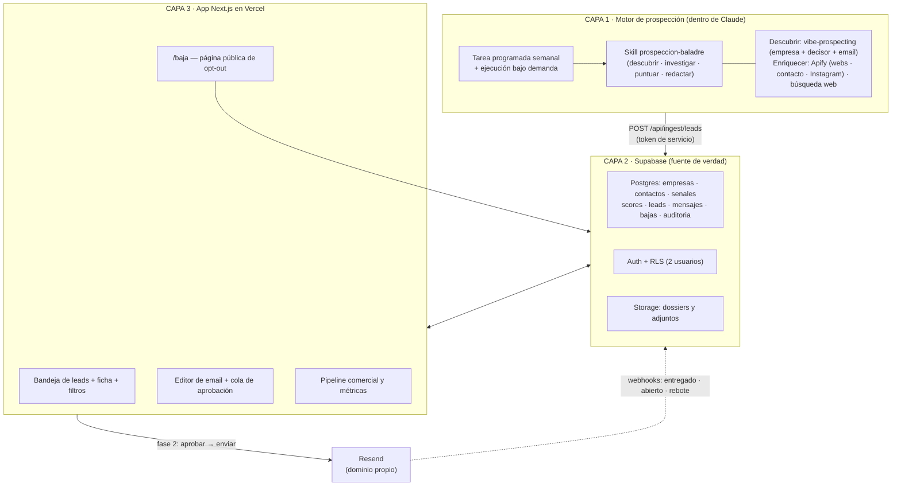
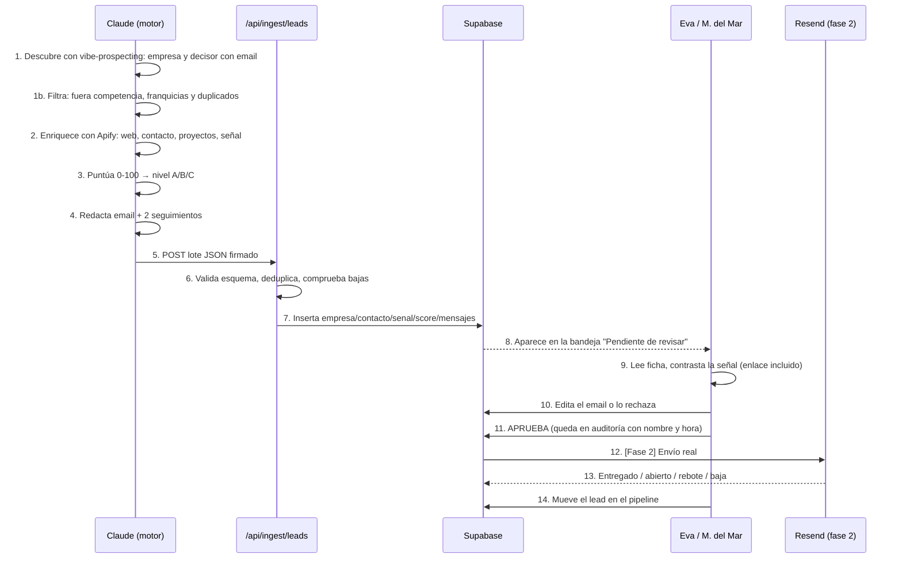
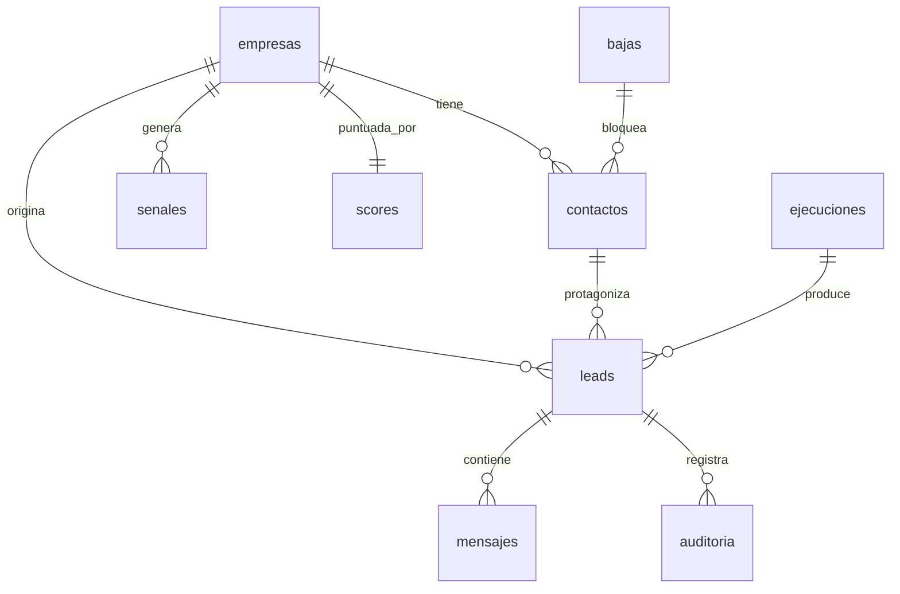

# ARQUITECTURA — Sistema de prospección Baladre Cerámica

> Versión 1.0 · 21 agosto 2026 · Documento de diseño técnico
> Léelo antes que el PRD si quieres entender **cómo** encaja todo; el PRD explica **qué** hace y **por qué**.

---

## 1. La idea en una frase

Un **motor de prospección que vive dentro de Claude** encuentra e investiga empresas del cliente ideal de Baladre, las puntúa y escribe un borrador de email por lead; una **base de datos en Supabase** guarda todo; y una **app web en Next.js** es la consola donde Eva y María del Mar revisan, editan, aprueban y (fase 2) envían.

La analogía: Claude es el comercial que sale a la calle a buscar y preparar; Supabase es el archivador; la app es la mesa donde se aprueba lo que sale por la puerta. Nada sale sin que una persona lo firme.

---

## 2. Las tres capas

### Capa 1 — El motor (Claude)

**Por qué vive en Claude y no en la app:** las mejores fuentes de datos disponibles hoy sin contratar nada (la skill `vibe-prospecting`, la búsqueda web con criterio, la lectura de una web de un estudio de arquitectura para entender si encaja) sólo funcionan con un modelo razonando por encima. Meterlas en una función de Vercel significaría reconstruirlas peor y más caro.

**Cómo se dispara:**

| Modo | Quién lo lanza | Frecuencia | Qué hace |
|---|---|---|---|
| Automático | Tarea programada de Claude (Cowork) | Semanal, lunes | Busca señales nuevas en el ICP y añade 10-20 leads cualificados |
| Bajo demanda | Nuria o Eva desde una conversación con Claude | Cuando haga falta | "20 estudios de interiorismo en Valencia con obra hotelera" |
| Reenriquecimiento | Tarea programada | Mensual | Revisa leads dormidos, busca señales nuevas, recalcula score |

**Qué produce:** un JSON validado por lote (empresas + contactos + señales + score + borradores) que se envía al endpoint de ingesta de la app.

### Capa 2 — Supabase

Fuente única de verdad. Sustituye al Google Sheets `BALADRE_LEADS` actual (que se migra en la fase 0). Postgres con RLS activo, Auth con dos usuarios reales, y una `service_role` reservada exclusivamente para el endpoint de ingesta.

### Capa 3 — La app (Next.js en Vercel)

No busca leads. **Muestra, edita, aprueba y mide.** Es deliberadamente tonta: si Claude está caído, la app sigue funcionando con lo que ya hay en la base de datos.

---

## 3. Flujo completo de un lead

**Punto crítico:** entre el paso 11 y el 12 hay una persona. Siempre. No hay modo "enviar todo".

---

## 4. Modelo de datos

| Tabla | Para qué sirve | Campos clave |
|---|---|---|
| `empresas` | La organización | `nombre`, `segmento`, `web`, `dominio`, `ciudad`, `provincia`, `fuente`, `fuente_url` |
| `contactos` | La persona con la que se habla | `empresa_id`, `nombre`, `cargo`, `rol_decision`, `email`, `email_estado`, `linkedin_url` |
| `senales` | Por qué escribir **ahora** | `tipo`, `titulo`, `resumen`, `url`, `fecha`, `peso` |
| `scores` | Cuánto encaja con el ICP | `puntuacion`, `nivel`, `desglose` (jsonb), `motivo`, `calculado_at` |
| `leads` | La unidad de trabajo (empresa + contacto) | `estado`, `prioridad`, `responsable`, `siguiente_accion_at` |
| `mensajes` | Los emails | `tipo`, `asunto`, `cuerpo`, `angulo`, `estado`, `editado_por_humano`, `aprobado_por` |
| `bajas` | Lista de supresión | `email`, `dominio`, `motivo`, `origen`, `fecha` |
| `auditoria` | Quién hizo qué y cuándo | `actor`, `accion`, `entidad`, `antes`, `despues` |
| `ejecuciones` | Cada tanda del motor | `tipo`, `parametros`, `leads_nuevos`, `coste_estimado`, `log` |
| `config_icp` | Pesos y criterios editables sin tocar código | `clave`, `valor` (jsonb) |

El esquema SQL completo está en `supabase/schema.sql`.

---

## 5. Modelo de scoring ICP (0-100)

Traducción directa de la diapositiva 09 y del reparto de esfuerzo comercial (30/25/25/10/5/5) de la presentación.

| Bloque | Máx. | Cómo se puntúa |
|---|---|---|
| **Encaje de segmento** | 30 | Arquitectura/interiorismo 30 · Agencia comunicación/eventos 30 · Grupo tipo Vocento 28 · Hotel premium 20 · Restauración 12 · Joyería/retail 8 |
| **Potencial de recurrencia** | 20 | ¿Genera encargos repetidos? Estudio con cartera hotelera, agencia con premios anuales, grupo con calendario de eventos = alto |
| **Señal de oportunidad activa** | 25 | Premio/gala anual, apertura, reforma, aniversario, proyecto publicado, congreso. Sólo puntúa si hay URL verificable de los últimos 18 meses |
| **Accesibilidad del decisor** | 15 | Email nominal verificado 15 · Nominal probable 10 · Sólo genérico 5 · Ninguno 0 |
| **Proximidad** | 10 | Alicante/Valencia/Murcia 10 · Madrid/Barcelona/Baleares 7 · Resto de España 5 · Internacional 2 |

**Umbrales:** A ≥ 75 · B 55-74 · C 40-54 · Descartado < 40.

**Descarte automático** (sin puntuar): fabricantes o talleres de cerámica (competencia), constructoras genéricas sin componente de diseño, franquicias de bajo precio, empresas sin web, empresas ya en `bajas`, y cualquier empresa donde la señal no se pueda verificar con una URL.

Los pesos viven en `config_icp`, no en el código: se ajustan desde la app cuando el mercado responda.

---

## 6. Reglas de redacción del email

El motor **no puede** generar un email si no tiene una `senal` con URL verificable. Sin señal, el lead entra como "cualificado sin gancho" y espera.

- Máximo 120 palabras. Asunto máximo 45 caracteres, sin palabras de venta.
- Primera frase = la señal concreta y verificable de ese cliente. Nunca "he visto vuestra web".
- Nunca las palabras: *cerámica hecha a mano*, *artesanal*, *proveedor*, *presupuesto sin compromiso*.
- Sí el marco de la presentación: identidad, experiencia, recuerdo, diferenciación, socio creativo.
- Un solo CTA: conversación de 20 minutos **o** enviar el dossier. Nunca los dos.
- Sin adjuntos en el primer email. Sin enlaces de seguimiento agresivos.
- Firma con identificación real de Baladre + enlace de baja (obligatorio, ver §8).
- Tres ángulos según segmento, definidos en `CLAUDE.md`.

---

## 7. Conectores y fuentes recomendados

### Dentro del motor (Claude)

**El descubrimiento lo hace `vibe-prospecting` y el enriquecimiento Apify.** Cada uno tiene su documento: **`VIBE_PROSPECTING.md`** (recetas verificadas, cobertura medida y tres trampas que hacen que una consulta devuelva cero) y **`APIFY.md`** — pipeline de tres pasos, actores concretos con sus precios, recetas de búsqueda por segmento, control de coste y límites que respetamos. Léelo antes de tocar el motor.

| Conector | Para qué | Coste | Confianza |
|---|---|---|---|
| **Vibe Prospecting** | **Descubrimiento**: empresa del ICP **y decisor con email**, por sector, región y tamaño. Es el único canal que da la persona | Créditos propios; consumo real sin medir todavía (P-12) | Cobertura medida el 22/08/2026: 1.043 estudios pequeños en Levante, 75 decisores con email en arquitectura, 96 en hostelería, 4.619 en agencias en España |
| **Apify** (3 actores + 1 de reserva) | **Enriquecimiento**: contacto desde la web, contenido del sitio, señal reciente en Instagram. Google Maps queda como recurso puntual | Free 5 $/mes de crédito; ≈0,89 $ por tanda de 20 leads | Precios verificados el 21/08/2026 |
| **WebSearch/WebFetch + directorios** | Señales: premios, aperturas, proyectos publicados. Y el trabajo nominal de los grupos tipo Vocento | Incluido | Alta |
| MCP de Supabase | Consultar el estado antes de buscar (evitar duplicados y gasto inútil) | Gratis | Alta |
| MCP de Gmail | Fase 2: detectar respuestas | Ya conectado | Alta |

**Reparto del trabajo entre Apify y el modelo:** Apify trae materia prima en volumen; Claude filtra, cualifica y escribe. El filtro va **entre** el paso de descubrimiento y el de enriquecimiento, porque enriquecer lo que ya sabemos que no encaja es donde se va el presupuesto.

**LinkedIn no está en el pipeline.** Sus condiciones prohíben la extracción automatizada y el riesgo recae sobre una cuenta real. La sección 8 de `APIFY.md` explica el porqué y qué se usa en su lugar.

### Fuentes públicas sectoriales (las de mayor precisión de ICP)

Arquitectura e interiorismo: colegios de arquitectos territoriales (CTAA Alicante, CTAV Valencia), CSCAE, premios de arquitectura de la Comunitat Valenciana, FAD, publicaciones de proyectos.
Agencias y eventos: Club de Creativos, El Sol, directorios de agencias de eventos.
Hoteles premium: guías de hotelería de lujo y grupos independientes; aperturas anunciadas en prensa del sector.
Restauración: guías gastronómicas y aperturas destacadas.
Grupos tipo Vocento: calendario público de premios, congresos y eventos corporativos.

> No estoy seguro de la disponibilidad actual ni de las condiciones de uso de cada directorio concreto. Antes de automatizar la extracción de cualquiera de ellos hay que leer sus términos; algunos prohíben el scraping. Está anotado como pendiente en `ESTADO.md`.

### En la app

| Servicio | Para qué | Coste verificado (21/08/2026) |
|---|---|---|
| Supabase | Base de datos, auth, storage | Free: 500 MB, **pausa el proyecto tras 1 semana sin actividad**. Pro: desde 25 $/mes |
| Vercel | Hosting de la app | Hobby gratis pero **restringido a uso no comercial**; Pro 20 $/mes. Cron en Hobby: sólo 1 vez al día |
| Resend | Envío en fase 2 | Free: 3.000 emails/mes, 100/día, 3 dominios. Pro: 20 $/mes |
| API de Anthropic | Si algún día el motor se mueve a la app | Por uso |

**Consecuencia de presupuesto:** con el límite de ~50 €/mes que has puesto, la combinación realista es Supabase Free + Vercel Pro (20 $) + Apify Free o Starter + Resend Free ≈ 20-49 $/mes. El punto que decide es Vercel: el plan gratuito no cubre un uso comercial. Alternativas más baratas (Railway, Render, o el propio Supabase Edge Functions) están anotadas como decisión abierta.

---

## 8. Cumplimiento — RGPD, LSSI y AI Act

Esto no es un anexo: condiciona el diseño.

**Datos.** Sólo datos de contacto profesional obtenidos de fuentes públicas o del propio sitio de la empresa. Se guarda **siempre** el origen (`fuente`, `fuente_url`) de cada dato: sin origen trazable, el dato no entra.

**Envío.** Cada email lleva identificación completa de Baladre, la razón por la que se contacta y un enlace de baja de un clic que escribe en `bajas`. El endpoint de ingesta y el de envío consultan `bajas` **antes** de cada operación.

**Derechos.** Página pública `/baja` (ya tienes el patrón montado en el sistema anterior) y buzón de ejercicio de derechos. Borrado real, no marcado.

**Persona en el bucle.** Ningún mensaje sale sin aprobación humana registrada en `auditoria` con usuario, hora y contenido exacto aprobado. Es la garantía que ya usabas como supervisión humana en el proyecto anterior.

> [Confianza media — verificar con un abogado antes de la fase de envío] El email comercial B2B en España se apoya normalmente en el interés legítimo del RGPD, pero el artículo 21 de la LSSI restringe las comunicaciones comerciales por email no solicitadas. La práctica habitual (contactos profesionales de fuentes públicas, dirección corporativa, identificación y baja en cada envío) reduce el riesgo pero no lo elimina. Esta parte del diseño debería revisarla alguien con criterio jurídico antes de activar la fase 2. No inventes aquí una interpretación cómoda.

---

## 9. Qué NO hace este sistema

- No envía nada solo.
- No inventa emails ni cargos: si no hay fuente, el campo queda vacío y el lead baja de score.
- No compra bases de datos ni usa listas de terceros.
- No hace scraping de LinkedIn ni de ninguna fuente que lo prohíba en sus términos.
- No sustituye la reunión: su trabajo termina cuando hay una conversación abierta.
